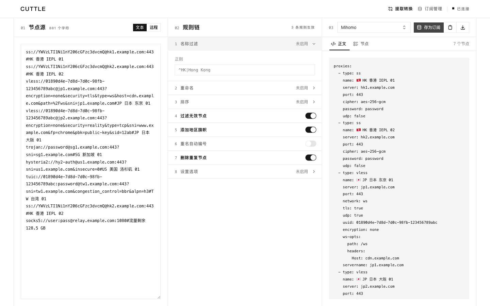

<p align="center">
  
</p>

<p align="center">
  <a href="#功能概览">功能概览</a> ·
  <a href="#使用指南">使用指南</a> ·
  <a href="#部署到-cloudflare">部署到 Cloudflare</a> ·
  <a href="#部署到-vps">部署到 VPS</a> ·
  <a href="#安全边界">安全边界</a>
</p>

**CuttleX**（旧名 Cuttle，威力加强版）是一个运行在 Cloudflare Workers 上的通用代理节点转换器。它能自动识别节点或订阅内容，按规则完成筛选、重命名、排序与去重，再生成 Mihomo、Clash、sing-box、Surge、Loon 等客户端可以直接使用的格式。

临时转换无需登录；需要持续同步上游时，也可以保存为长期订阅，让客户端通过固定地址获取最新结果。节点管理与订阅管理相互配合：转换器产出的节点可以直接导入节点库，订阅再从节点库引用成品节点，形成完整的"提取 → 导入 → 管理 → 发布"闭环。应用和数据均保留在你自己的 Cloudflare 账户中。

除了 Cloudflare 云部署，也支持把应用整个跑在自己的 VPS 上（`wrangler dev` 本地 workerd + SQLite），数据完全本地化、无需任何云账户。

## 功能概览

### 输入与协议

CuttleX 无需预先指定格式，可以直接识别：

- 节点 URI 列表、Base64 订阅和 SSD
- Clash / Mihomo YAML
- sing-box JSON、Xray / V2Ray JSON
- Surge、Loon、Quantumult X、Egern 节点行
- 包含节点信息的网页内容

来源可以是直接粘贴的文本，也可以是一个或多个远程订阅。多个远程来源会按填写顺序读取并合并。

支持的协议包括：SS、SSR、VMess、VLESS、Trojan、Hysteria、Hysteria 2、TUIC、AnyTLS、Snell、Mieru、WireGuard、SSH、HTTP(S) 和 SOCKS5。

VLESS 除了标准 URI 外，还支持 Xray 家族客户端（如 Hiddify、v2rayN）导出的 base64 信封变体（`vless://<base64>[加密:]uuid@host:port`）、以及 mieru 官方的 `mierus://` 分享链接。

### 规则处理

规则链中的步骤会依次执行，后一条规则处理前一条规则的结果。当前支持：

- 按名称正则筛选
- 使用正则表达式批量重命名
- 按名称或协议排序
- 过滤无效节点
- 添加地区旗帜
- 为重名节点自动编号
- 删除重复节点
- 批量设置 UDP、TFO 和跳过证书验证

规则不是必需的。规则链为空时，CuttleX 会直接转换识别出的节点。

### 输出客户端

CuttleX 支持 14 种输出格式：

| 客户端       | `target`       | 客户端       | `target`       |
| ------------ | -------------- | ------------ | -------------- |
| 通用 URI     | `uri`          | Mihomo       | `mihomo`       |
| Clash        | `clash`        | Stash        | `stash`        |
| sing-box     | `sing-box`     | Xray         | `xray`         |
| V2Ray        | `v2ray`        | Surge        | `surge`        |
| Surge Mac    | `surge-mac`    | Surfboard    | `surfboard`    |
| Egern        | `egern`        | Loon         | `loon`         |
| Quantumult X | `quantumult-x` | Shadowrocket | `shadowrocket` |

不同客户端支持的协议、传输方式和字段并不完全相同。CuttleX 只输出目标客户端能够准确表示的节点；无法兼容的节点会被跳过，并在诊断信息中说明原因，不会为了保留数量而生成失真的配置。

### 节点管理（成品节点库）

独立的"节点"页面用于维护成品节点：

- 支持从共享链接（`ss://`、`vless://`、`mierus://` 等）一键导入
- 解析结果直接落库，可编辑名称、服务器、端口、国家、协议字段等
- 工作台"提取/转换"的结果可以导入节点库，节点库中的节点再被订阅引用
- 支持删除与批量导入

### 长期订阅

来源、规则链和默认输出格式可以保存为长期订阅：

- 文本来源会持续使用保存时的内容
- 远程来源会在每次访问时重新读取上游，再应用规则并生成结果
- 工作台生成的节点会保存为持久化节点池，此后可以继续向同一订阅追加新节点
- 订阅支持编辑、启用、停用、轮换 token 和删除
- 普通编辑与追加节点都不会改变订阅地址，只有轮换 token 会立即废止旧地址
- 停用后的订阅地址返回 `410`，但保存的配置仍会保留
- 订阅可引用节点库中的成品节点（nodes 源），节点库变化会在下次拉取时体现

## 使用指南

### 完成一次转换

1. 在"源"中粘贴订阅内容，或输入访问密码后填写远程订阅地址。
2. 按需添加并排列规则。
3. 在"输出"中选择目标客户端，然后点击"生成"。
4. 查看、复制或下载结果，并通过"节点"和诊断信息检查实际输出内容。

修改来源、规则或目标客户端后，已有结果会被标记为过期。再次点击"生成"即可刷新。

> 直接粘贴文本无需输入访问密码。读取远程来源、管理长期订阅和分组集合时，需要先使用部署时设置的访问密码进入管理面板。

### 保存为长期订阅

完成一次生成后，可以将当前配置保存为订阅：

1. 点击"存为订阅"。
2. 填写一个便于识别的名称。
3. 确认来源、规则链、默认客户端和启用状态。
4. 保存后立即复制生成的订阅地址。

```text
https://cuttle.your-worker.workers.dev/subscribe/<token>
```

完整 token 只会在创建和轮换时显示一次。订阅地址本身就是访问凭据，请妥善保管。

### 向持久化订阅追加节点

工作台保存的订阅使用持久化节点池，可以随时把新节点累积到同一条订阅：

1. 在订阅管理中打开订阅详情，点击"追加节点"。
2. 粘贴单个节点、节点列表或订阅内容（支持与转换相同的输入格式）。
3. 保存后，可识别的节点会合并进节点池；与池内已有节点重复的条目会自动跳过，未识别的内容会在结果中提示数量。
4. 追加不会改变订阅地址，客户端下一次拉取即可获得完整节点集。

节点池会按节点身份去重：同一服务器、端口与凭据的节点只保留一份，仅名称不同视为重复；凭据不同的同名节点会各自保留。

### 分组与集合管理

在"订阅管理"中可以直接重命名订阅、填写可选分组并搜索分组或名称。使用"新建集合"可以把多条"持久化节点"订阅按指定顺序合并成一条新的订阅；集合拥有独立的固定订阅地址，成员节点变化或集合成员调整后，地址仍然保持不变。集合只引用本实例中你有权管理的持久化节点，不会复制或公开额外来源权限。

### 用同一地址切换输出格式

在订阅地址后添加 `?target=`，可以临时指定输出格式，不会改变订阅保存的默认客户端：

```text
https://cuttle.your-worker.workers.dev/subscribe/<token>?target=sing-box
```

`target` 的可用值见上方[输出客户端](#输出客户端)表格。移除查询参数后，地址会恢复为订阅的默认格式。

## 部署到 Cloudflare

推荐使用 **Fork + GitHub Actions** 的方式进行部署。整个过程无需在本机安装开发环境；GitHub Actions 会自动完成 D1 数据库创建、数据库迁移、密钥上传以及 Worker 发布。

### 1. Fork 仓库并启用 Actions

Fork 本仓库，然后打开 fork 的 **Actions** 页面并启用工作流。（GitHub 默认不会为新建的 fork 启用 Actions，因此需要手动开启）

### 2. 准备 Cloudflare 凭据

部署需要 Cloudflare **Account ID** 和 **API Token**。

**Account ID**

在 Cloudflare Dashboard 中按 <kbd>Ctrl</kbd>/<kbd>Cmd</kbd> + <kbd>K</kbd>，搜索 `Copy account ID`；也可以前往 **Workers & Pages → Account details** 复制。

**API Token**

创建[账户令牌（account-owned token）](https://developers.cloudflare.com/fundamentals/api/get-started/account-owned-tokens/#create-an-account-owned-token)。

可以基于 **Edit Cloudflare Workers** 模板创建，并确保至少拥有以下权限：

| 权限            | 级别 | 用途                  |
| --------------- | ---- | --------------------- |
| Workers Scripts | Edit | 发布 Worker、上传密钥 |
| D1              | Edit | 创建数据库、应用迁移  |

### 3. 配置 GitHub Secrets

在 fork 的 **Settings → Secrets and variables → Actions** 中添加四个 Repository secret：

| Secret                  | 说明                                                |
| ----------------------- | --------------------------------------------------- |
| `CLOUDFLARE_API_TOKEN`  | Cloudflare API Token                                |
| `CLOUDFLARE_ACCOUNT_ID` | Cloudflare Account ID                               |
| `CUTTLE_LINK_KEY`       | 用于加密可恢复订阅 token 的独立密钥（至少 32 字节） |
| `CUTTLE_TOKEN`          | 用于登录 CuttleX 管理功能的单用户密码               |

其中，`CUTTLE_TOKEN` 是进入管理面板的唯一凭据；输入后会先经服务端验证，密码只保存在当前浏览器会话。`CUTTLE_LINK_KEY` 用于加密管理面板再次复制固定订阅链接所需的 token。修改它会使旧链接仍可交付，但旧 token 无法自动从面板恢复；可在订阅详情中粘贴原完整链接重新登记，或轮换 token。若部署到公网，请务必为两个密钥都使用足够长、随机且不可预测的字符串，并妥善保存。

`CUTTLE_PUBLIC_ORIGIN` 用于生成固定订阅链接的公开地址（如 `https://your-domain.example`）；自托管时请将 `wrangler.json` 中的值改成自己的公开域名，未配置时使用当前访问域名。

> 四个 Secret 缺一不可。配置不完整时，相关部署步骤将失败或被跳过。

### 4. 运行部署

打开 **Actions → Deploy → Run workflow**。部署成功后，工作流会给出一个 `cuttle.*.workers.dev` 地址。

之后向仓库推送 `v*` 标签也会自动部署；运行 `pnpm release` 可以协助更新版本并创建标签。

### 5. 跟随上游更新

fork 中的 **Sync upstream** 工作流每天检查一次上游正式版本，也可以在 Actions 页面手动运行。

- 仅同步正式版本：只处理 `v*` 正式版本，自动跳过 `v1.0.0-rc.1` 等预发布版本
- 仅允许快进更新：如果 Fork 的默认分支包含自行提交的改动，工作流会停止并报错，不会覆盖现有内容
- 同步与部署相互独立：即使 Cloudflare Secrets 未配置完整，上游代码仍可正常同步，但不会继续触发部署
- 注意 GitHub 定时任务限制：长期无活动的公开仓库可能会被 GitHub 暂停 Scheduled Workflow；遇到这种情况，可进入 Actions 页面重新启用

如果你对 Fork 做过自己的修改，建议在同步上游前确认提交历史，避免因为分支无法快进而导致自动同步中断。

### 6. 绑定自定义域名（可选）

默认的 `cuttle.*.workers.dev` 地址可以直接使用。若要绑定自定义域名，请在 Cloudflare Dashboard 中打开该 Worker，并在域名与路由设置中添加 Custom Domain。

更换域名不会影响应用功能，但已经添加到客户端的订阅地址不会自动更新。

## 部署到 VPS

CuttleX 的运行时是 Cloudflare 的 workerd，因此**不需要 Cloudflare 账户**也能自托管：`wrangler dev` 会在本机启动一个与线上行为一致的 workerd 进程，D1 数据库落在本机 SQLite 文件（`.wrangler/state`），数据完全归你所有。适合有 VPS、希望数据不出境或不想依赖云服务的场景。

### 方式一：一键脚本（Ubuntu / Debian）

在 VPS 上以 root 执行（会安装 Node.js 22、拉取代码、构建、初始化数据库，并注册为 systemd 服务）：

```bash
sudo bash deploy/vps.sh
# 自定义端口 / 公开域名 / 密码：
# sudo bash deploy/vps.sh --port 8080 --host 0.0.0.0 --token 你的管理密码 --origin https://example.com
```

脚本完成后访问 `http://<服务器IP>:8787`，用脚本输出的管理密码登录。服务日志用 `journalctl -u cuttlex -f` 查看。

### 方式二：Docker Compose

```bash
cp .env.example .env        # 编辑 CUTTLE_TOKEN / CUTTLE_LINK_KEY
docker compose up -d --build
```

数据保存在 `./data/cuttlex`（D1 SQLite），备份该目录即备份全部数据。

> VPS 部署与 Cloudflare 版功能完全一致（含 D1 迁移）。如果常用域名，建议为服务配置 Nginx 反向代理并启用 HTTPS（脚本末尾提供示例配置）。

## 安全边界

- 订阅地址本身就是访问凭据；完整 token 只会在创建和轮换时显示一次
- 持久化节点池的节点凭据通过订阅地址对外提供：地址与池中节点等同公开，只应导入你有权共享的节点
- 远程来源只允许 HTTP(S) 公网地址，并受链接数量、响应体积、重定向次数和请求超时限制
- 订阅来源和生成结果以明文保存在 D1 中；数据库导出文件同样包含完整订阅内容，应按敏感数据处理
- CuttleX 只提取、处理和转换代理节点，不生成规则集或完整客户端配置，也不会执行用户脚本
- 浏览器缓存策略：HTML 文档响应 `no-cache`，每次访问都会重新验证，保证部署更新后不会出现旧页面引用已下线资源的问题；哈希化的静态资源（CSS/JS）则使用长达一年的 `immutable` 缓存

## 合规与可接受使用

CuttleX 是面向合法用途的节点格式转换与管理工具，例如整理你自己拥有、租用或获得明确授权的服务器与网络设备配置。请遵守以下边界：

- 仅将 CuttleX 用于你拥有或获准使用的服务器与网络资源
- 遵守你所在地及服务器所在地的法律法规，以及所使用服务（含客户端、上游订阅）的服务条款
- 不要将 CuttleX 用于未经授权的访问、入侵、恶意活动，或规避法律禁止的行为
- 订阅地址包含节点凭据，等同于访问凭据，只应与你有权共享的人分享

部署者对自己的实例及其使用方式负责。
